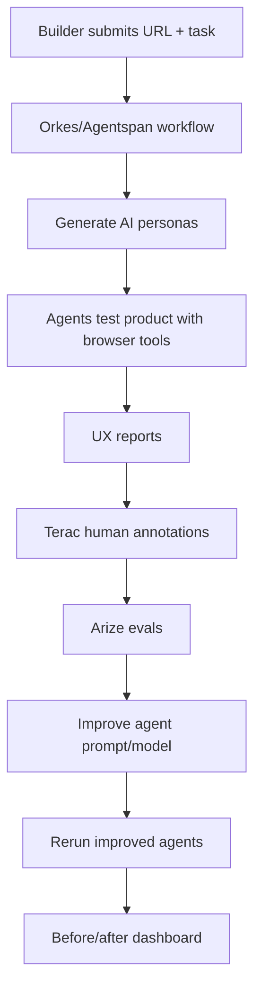

# UserSwarm

**AI user-testing agents for builders, validated by real human feedback.**

A builder enters a product URL + a task to test. The app fans out multiple AI personas
that test the product with browser tools and generate UX reports. Real humans (via Terac)
label the reports, Arize traces + evaluates every run, and the agent is improved and rerun
to prove measurable before/after gains.

> We are not replacing human research. We make AI user testing trustworthy by calibrating
> synthetic user agents with Terac human feedback and proving improvement with Arize evals,
> all orchestrated through Orkes Agentspan.

## Sponsor stack (the real core three)

| Sponsor               | Role in app                                                        |
| --------------------- | ------------------------------------------------------------------ |
| **Orkes / Agentspan** | Durable multi-agent workflow engine — orchestrates the agents      |
| **Terac**             | Human annotation + preference labels to improve the agent          |
| **Arize**             | Tracing + evals — proves before/after improvement                  |

Pika is skippable unless there's extra time.

## Core flow



## Agents (Agentspan)

| Agent                   | Job                                               |
| ----------------------- | ------------------------------------------------- |
| `PersonaGeneratorAgent` | Creates 3-5 realistic user personas               |
| `UXTesterAgent`         | Acts as a persona and tests the app               |
| `ReportCriticAgent`     | Checks if each report is specific/useful          |
| `AggregatorAgent`       | Combines findings into one builder report         |
| `ImproverAgent`         | Uses Terac + Arize feedback to improve the prompt |

Browser actions are exposed to Agentspan as `@tool`s (Playwright-backed):
`open_url`, `click_by_text`, `type_into_field`, `get_page_state`, `scroll`.

```bash
pip install agentspan
agentspan server start   # UI at http://localhost:6767
```

## Terac — human validation layer

Annotation environment at `/annotate/[runId]`. Annotator sees product description, task,
persona, the agent's UX report (+ screenshot/step log) and answers rating questions:

| Question                                   | Type         |
| ------------------------------------------ | ------------ |
| Is this feedback useful to a builder?      | 1-5 rating   |
| Is the report specific, or vague?          | 1-5 rating   |
| Did the agent hallucinate anything?        | Yes/No       |
| Did the agent complete the task correctly? | Yes/No       |
| Would a real user likely agree?            | 1-5 rating   |
| Which report is better, base or improved?  | Pairwise A/B |

Hackathon-safe loop: base agent → Terac labels → improved prompt/rubric → rerun → prove gains.
Constraints: build annotation env, call Terac API/MCP, $250 credit, general-population
annotators, improve model with collected data. Judging: 40% model improvement,
35% annotation UX, 25% smart use of human data.

## Arize — proof layer

Trace every run (input: URL, product, persona, task; output: task success, step log,
friction, recommendations, confidence). Evals to build:

| Eval                 | Type             | Purpose                                             |
| -------------------- | ---------------- | --------------------------------------------------- |
| `has_task_success`   | code eval        | Report includes task success true/false             |
| `has_evidence`       | code eval        | Each issue has evidence/screenshot/page step        |
| `actionability`      | LLM eval         | Recommendations are specific and useful             |
| `hallucination_risk` | LLM eval         | Report invents unsupported UI claims                |
| `human_agreement`    | Terac-based eval | AI report vs Terac human labels                     |
| `improvement_score`  | experiment eval  | Base vs improved agent                              |

## Before / after story (demo metrics)

| Metric                  | Base Agent | Improved Agent |
| ----------------------- | ---------: | -------------: |
| Human usefulness rating |      3.1/5 |          4.2/5 |
| Reports with evidence   |        55% |            90% |
| Hallucination risk      |        28% |             8% |
| Human agreement         |        62% |            81% |
| Actionability pass rate |        50% |            85% |

## Builder input

Required: URL, product description, target audience, task, success criteria.
Optional: test login, pages to avoid, do-not-click rules, competitors, prototype link,
specific personas.

`UXTesterAgent` returns strict JSON:
`persona, task_success, step_log, friction_points, evidence, severity, recommendations, confidence`.

## Tech stack

| Layer               | Tool                        |
| ------------------- | --------------------------- |
| Frontend            | Next.js + TypeScript + Tailwind |
| Backend             | FastAPI (Python)            |
| Agent orchestration | Agentspan                   |
| Browser automation  | Playwright                  |
| Human labels        | Terac API/MCP               |
| Tracing/evals       | Arize AX / OpenInference    |
| Database            | Supabase or SQLite/Postgres |
| LLM                 | Claude (default) or OpenAI  |

## Build order

1. Input dashboard
2. Agentspan workflow with fake/static page analysis first
3. Playwright browser tools
4. Structured persona UX reports (strict JSON)
5. Arize tracing
6. Arize evals
7. Terac annotation page
8. Store human labels
9. Improve prompt from labels
10. Rerun improved agent
11. Before/after dashboard

Guardrails: working demo flow first, no destructive browser actions, strict JSON outputs.

## Setup

Copy `.env.example` to `.env` and fill in keys. See `.env.example` for required vars.
